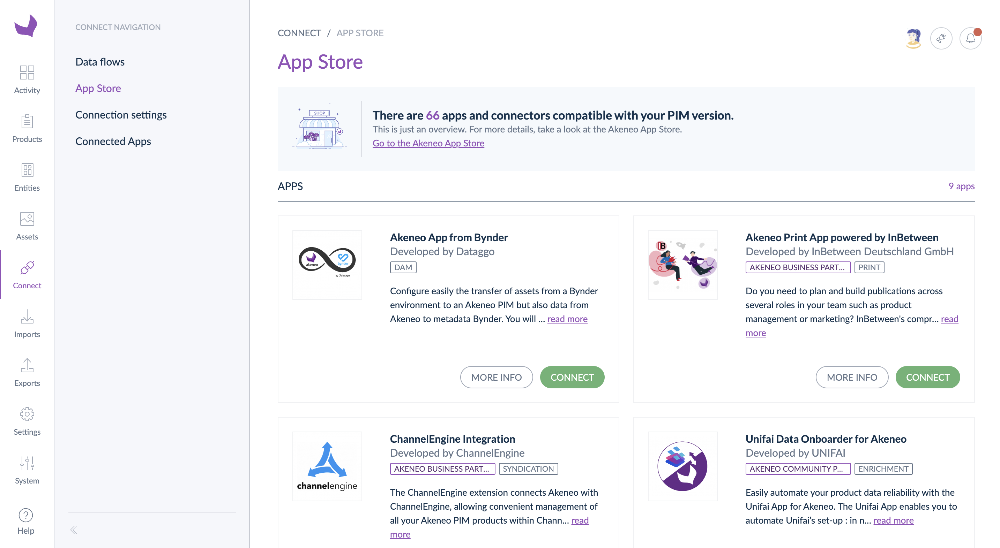
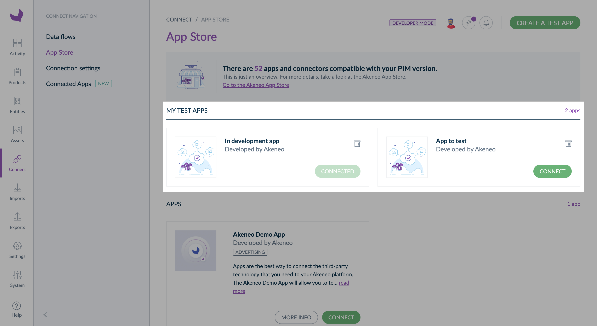
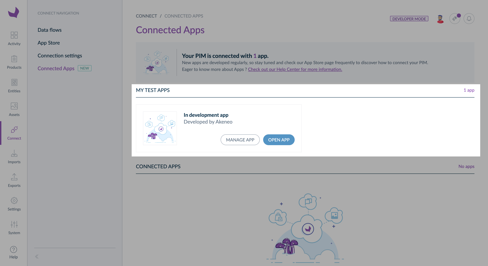

# Getting started

## Overview

Before you start planning and developing your App, it's essential to understand what Akeneo apps do and how they fit into Akeneo PIM.

### What's an Akeneo app?

An Akeneo App connects Akeneo PIM with third-party solutions. They can be easily connected directly from within PIM, with a streamlined process of activation and configuration.

Most Akeneo apps are built by third-party developers, not by Akeneo.

You can build an app to pull Akeneo data into your App to adapt and distribute it to external services, like e-commerce platforms or marketplaces. You can also push data to enrich the Akeneo PIM with translations, ERP data, assets, data pool content, or other sources.

To tailor experiences to their specific needs, Akeneo users connect Akeneo apps to integrate with external services and improve how they collect, enrich and distribute their data.


### How apps fit into Akeneo PXM Studio?

Apps integrate with Akeneo in the following ways:

- using OAuth2.0 protocol to connect with Akeneo
- using app catalogs to provide a consistent experience to users
- connecting with our REST API to read and write Akeneo data


::: info
For more information on Apps usage, please read our help center articles
[How to connect Akeneo PIM with third parties](https://help.akeneo.com/pim/serenity/articles/how-to-connect-my-pim-with-apps.html)
and [Manage your Apps](https://help.akeneo.com/pim/serenity/articles/manage-your-apps.html).
::::


### Why apps over connectors?

Both connectors and Apps use the OAuth standard. However, there are some significant differences.

**AUTOMATIC CONFIGURATION INSTEAD OF MANUAL CONFIGURATION**

***Connectors use Akeneo PIM connections to get credentials***

The user who connects Akeneo PIM with a connector must create a connection and manually configure authorizations and permissions. Then, they copy/paste generated API credentials from the PIM UI to the connector. 

***Apps use the Connect feature***

When a user connects Akeneo PIM with an App, they click on Connect then follow the step-by-step activation process to accept requested authorizations and set up permissions. The App receives everything it needs to interact with Akeneo PIM at the end of this process. No more manual configuration issues and more transparency!

**HIGH VISIBILITY**

We give your App high visibility when you publish an App on the [Akeneo App Store](https://apps.akeneo.com/). Your App is displayed ***above all connectors***. We also give high visibility to Apps to our Akeneo PIM users. To do so, we created a ***dedicated section*** to highlight them in the PIM App Store.




**THIS IS JUST THE BEGINNING!**

Akeneo promotes Apps and will communicate about new Apps published on the Akeneo App Store.

Akeneo teams are also investing in Apps by developing new features for you to ease and accelerate App development and publication in the coming years. 

And we are going to need your input so get ready to hear about us! 🎙️

### Next steps

- Learn how to [create an app](/apps/apps-getting-started.html#create-an-app)
- Read our documentation about [authorization and authentication](/apps/authentication-and-authorization.html)
- Learn how to use [catalogs](/apps/catalogs.html) to retrieve product data

<!------------------------------ end of the Overview ------------------------------------>

## Create an app

You're ready to create a new app. You want to set up your development environment so that you can start coding.

In this tutorial, we provide a guide on how to implement the required parts of your App for the activation process based on OAuth 2.0 with Authorization Code.

At the end of this tutorial, your App will receive an Access Token and will be able to call the REST API of a PIM.

::: info
Please go to our [REST API Reference page](/api-reference-index.html) to learn more about our REST API endpoints. And if you want to know more about response codes, pagination, filters, or get troubleshooting information, go to the REST API basics page.
:::

### What you will learn
In this tutorial, we provide a guide on how to implement the required parts of your App for the activation process based on OAuth 2.0 with Authorization Code.
At the end of this tutorial, your App will receive an Access Token and will be able to call the REST API of a PXM Studio.

::: warning
Examples in this tutorial use languages without any framework or library and, consequently, don't follow all the recommended best practices. 
We strongly encourage you to adapt those examples with the framework or library of your choice.
:::

### Requirements
- You have a Partner account and a developer sandbox.
- You understand what's an Akeneo App and how they fit into Akeneo PXM Studio
- You've installed a PHP version >= 7.4 and Composer.

### Step 1: Expose your activation and callback URLs

First, your application must expose an **activation URL**.

In our example, we won't do additional steps (like authentification), so we will launch the Authorization Request immediately in this Activation URL.

!!!include(content/apps/create-app/activate-php.md)!!!
!!!include(content/apps/create-app/activate-nodejs.md)!!!
!!!include(content/apps/create-app/activate-python.md)!!!
!!!include(content/apps/create-app/activate-java.md)!!!

Then, your application must expose a **callback URL**.

!!!include(content/apps/create-app/callback-php.md)!!!
!!!include(content/apps/create-app/callback-nodejs.md)!!!
!!!include(content/apps/create-app/callback-python.md)!!!
!!!include(content/apps/create-app/callback-java.md)!!!

::: info
You can find more information about the authorization process and code challenge in the following documentation. 
- [Step 2: Ask for authorizations](/apps/authentication-and-authorization.html#step-2-ask-for-authorizations)
- [What's the code challenge?](/apps/authentication-and-authorization.html#whats-the-code-challenge)
:::

::: tips
Reminder: our documentation is [open-source](https://github.com/akeneo/pim-api-docs). Feel free to contribute with languages we're not experts at.
:::

### Step 2: Get a public URL for your in development App

Before proceeding to step 4 create a test App in your developer sandbox, you will need valid URLs to your App. This can be easily resolved with a tunnel to your localhost.

There are several ways to create a tunnel to your localhost such as **localhost.run** or **ngrok**. We will use [localhost.run](https://localhost.run/) for its free and easy setup.

#### Initiate localhost tunnel

Initiate localhost tunnel using the following command:

```shell

ssh -R 80:localhost:8080 localhost.run
```

The command above assumes that your local App is available on port 8080 but you can specify any port you want.


#### Extract URL from the output

If everything goes well the command will output your public URL for your local app:

```shell

46672a93dd64.lhrtunnel.link tunneled with tls termination, https://46672a93dd64.lhrtunnel.link
```

Your local app is now available at `https://46672a93dd64.lhrtunnel.link`. You may now use it for your development.

### Step 3: Get your test app credentials

To get credentials for your app, you need to create a test app on your developer sandbox.


To create a test App: 
1. Go to `Connect`, then `App Store`
2. On the top right corner, click on `Create a test App` 
3. Fill in all the required information
4. Then click on `Create`
5. Copy/paste credentials in your app configuration file
6. And click on `Done`
7. Your test App appears on the App Store page


If you don't see the `Create a test App` button, please enable the `developer mode`.  
To do so, you need to:
1. Go to `System`, then `Roles`
2. Choose the role you use for your user
3. In the `Permissions` tab, scroll down and search for the `Developer mode` submenu
4. Select `Manage test apps`
5. Don't forget to save your modifications


### Step 4: Connect your test App and access its settings



Connecting a test App is like connecting a published App. 

1. Click on `Connect`
2. Your App opens in a new tab of your browser
3. Launch the connection process from your App
4. Follow all the activation process steps, then `Confirm`
5. Your test App is now connected with Akeneo PIM! 🔗

Now that your App is connected, you can enjoy all the available App features from the Akeneo PXM Studio UI and test that your App works well. 

To access the settings of your connected App on Akeneo PIM, please go to `Connected Apps`, then click on `Manage App`. 
You can also open your App from Akeneo PIM UI, to do so, click on `Open app`. 



::: info
To know more about the step-by-step activation process, please read our article:  
[How to connect an App?](https://help.akeneo.com/pim/serenity/articles/how-to-connect-my-pim-with-apps.html#how-to-connect-an-app)
:::

### Step 5: Use your access token to call the API

At the end of this process, you receive the following response with an `access_token`:

```json
{
  "access_token": "Y2YyYjM1ZjMyMmZlZmE5Yzg0OTNiYjRjZTJjNjk0ZTUxYTE0NWI5Zm",
  "token_type": "bearer",
  "scope": "read_products write_products"
}
```

You can use this token to call the Akeneo PIM REST API.


### Next steps

- Explore the [REST API reference](/api-reference-index.html)
- Start building your app by populating data to test your app against, designing your user interface, and interacting with the Akeneo REST API so that your app stays in sync with changing data.
