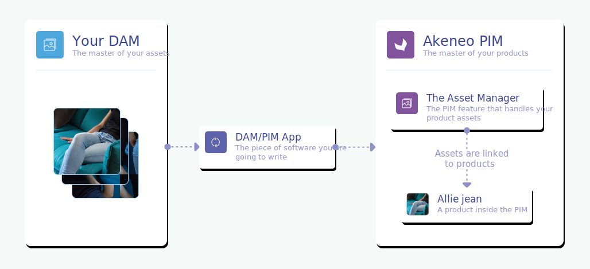
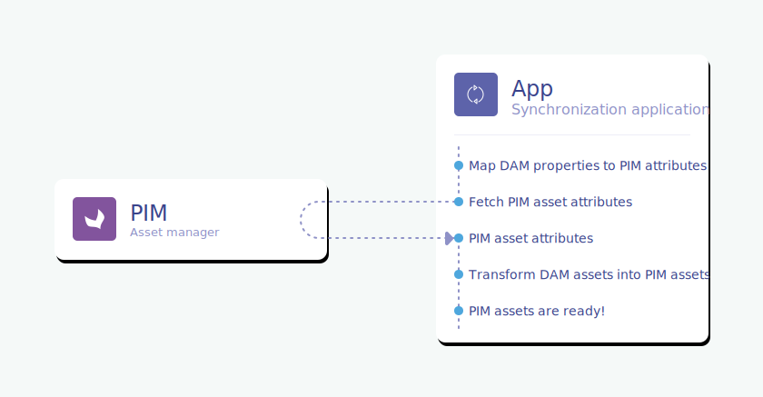

# Dive into the DAM-PIM synchronization

Alright, let's code now! In this section, you'll find everything you need to code your connector.

::: warning
Did you carefully read the previous sections? If not, you're missing some crucial steps and chances are you won't understand what's coming next. So, here you go: [here](introduction.html), [here](glossary.html), [here](pre-requisites.html) and [here](technical-stack.html).  
We promise it's worth the read. :wink:
:::

As a reminder, the connector is the piece of software that is between the DAM and the PIM and that's in charge of the synchronization of the DAM assets with the PIM, as illustrated in this diagram.



To be crystal clear, the goal of the connector is to collect assets from the DAM and send them to the PIM. Easy peasy, right?  

Well then! Let's zoom in on what's inside that connector.  
Below is the general diagram of what your connector will actually do under the hood.


It can be summed up in 3 steps:
- First, collect your DAM assets,
- Then, turn them into PIM assets,
- To finish, create those PIM assets in your PIM.

Tada! :tada:

## Collect assets from the DAM

The first step of the synchronization is to collect the available assets from the DAM.

Depending on your DAM capabilities, there are multiple ways to do it (API calls, message queue, ...).

See the [Define your technical stack](technical-stack.html) part of this documentation to have an idea of the different possibilities and their main constraints.

To collect those assets, first, you'll need to fetch the codes of the PIM asset families that you defined earlier in the [PIM structuration](pre-requisites.html#in-the-pim) step. To do so, you can either:
- call the PIM API [asset family GET endpoint](/api-reference-asset-manager.html#get_asset_families),
- write directly the codes of your asset families in a configuration file, the way we did in our [skeleton](https://github.com/akeneo/dam-connector/blob/master/config/resources/dam-example/mapping.yaml).

Thanks to the asset family codes, now, you'll be able to ask the DAM only for the assets that belong to those families. This is thanks to the upstream work you operated on the DAM side by [adding the asset family information on each of your assets](pre-requisites.html#which-asset-family-your-dam-product-assets-belong-to). It will avoid requesting the entire DAM data, which would be really useless and counterproductive. :wink:

Don't forget that, when collecting your DAM assets, you should also filter them to only request the **product** assets, thanks to the identification of product assets you've done earlier [here](pre-requisites.html#which-dam-assets-are-products-related).

## Transform DAM assets into PIM assets

We already covered in a previous [section](/pre-requisites.html#define-the-attributes-of-your-asset-families) that DAM and PIM assets have a totally different structure. 

Remember this example?


Your DAM and PIM assets don't share the same structure.  
And that is absolutely fine, by the way! DAM and PIM softwares do not serve the same purpose at all, so it is normal if they are not described by the same set of attributes/properties.

Your connector will need to run some transformations on your DAM assets in order to turn them into PIM assets. This is the goal of this step. You'll see it's a pretty big one, but don't worry we're here to guide you so you don't get lost somewhere along the way. :wink:

As we are in a more technical section, let's show some code! Below you'll find an example of a DAM asset, in JSON format, as it can be extracted thanks to the DAM API:

`GET /assets`
```json
[
    {
        "uid": "0A3C2A6E-4C32-4492-BC0DA02",
        "filename": "allie-jean_1_model-picture.png",
        "title": "Allie jean model picture 1",
        "url": "https://cdn.my-dam.com/l/579a05bbece1a1d/allie-jean_1_model-picture.png",
        "colors": "blue,lightblue",
        "tags": "jean,blue,pants",
        "warning_mention": "Not retouched photo",
        "pim_asset_family": "model_pictures",
        "asset_type": "Product photo",
        "type": "image",
        "photographer": "Eric Stiva",
        "updated": "2019-09-04 00:13:57"
    }
]
```

After this transformation step, here is how the JSON of the corresponding PIM asset will look like:

`PATCH /api/rest/v1/asset-families/model_pictures/assets`
```json
[
    {
        "code": "0A3C2A6E-4C32-4492-BC0DA02",
        "values": {
            "label": [
                {
                    "locale": null,
                    "channel": null,
                    "data": "Allie jean model picture 1"
                } 
            ],
            "dam_url": [
                {
                    "locale": null,
                    "channel": null,
                    "data": "https://cdn.my-dam.com/l/579a05bbece1a1d/allie-jean_1_model-picture.png"
                } 
            ],
            "main_colors": [
                {
                    "locale": null,
                    "channel": null,
                    "data": ["blue", "lightblue"]
                }
            ],
            "tags": [
                {
                    "locale": null,
                    "channel": null,
                    "data": ["jean", "blue", "pants"]
                }
            ],
            "disclaimer": [
                {
                    "locale": "en_US",
                    "channel": null,
                    "data": "Not retouched photo"
                }
            ],
            "product_ref": [
                {
                    "locale": null,
                    "channel": null,
                    "data": "allie-jean"
                }
            ]
        }
    }
]
```

The sub-sections below will guide you through all the steps needed to perform this transformation.

### Choose your PIM asset code

To create a PIM asset, you'll need a code. This code must be unique among all your PIM assets, regardless of the asset family they belong to.

We recommend you to use the unique identifier that is used in your DAM system as the code of your PIM asset. In our previous example, this identifier is the `uid`.  
So, it means that you need to transform this `uid` in your DAM asset: 
```json
"uid": "0A3C2A6E-4C32-4492-BC0DA02"
```
so that in your PIM asset, it becomes:
```json
"code": "0A3C2A6E-4C32-4492-BC0DA02"
```

Nothing fancy, but still, quite useful! :smile:

### Map DAM-PIM attributes

The second step in order for you to move forward with this transformation, requires a configuration that defines which property of the DAM each family attribute corresponds to.

This action of matching a DAM property to a PIM attribute will be called _mapping_ from now on.

For primary mapping use cases, a simple key-value configuration file may be enough.

As per our previous example, this file could look like that, in YAML format:
```yaml
model-pictures:
    title: label
    url: dam_url
    colors: main_colors
    tags: tags
    warning_mention: disclaimer
```

The `title` DAM property is mapped to the `label` PIM attribute.  
The `url` DAM property is mapped to the `dam_url` PIM attribute.  
The `colors` DAM property is mapped to the `main_colors` PIM attribute.  
The `tags` DAM property is mapped to the `tags` PIM attribute (yes, this one was pretty straight-forward :grinning-face:).  
The `warning_mention` DAM property is mapped to the `disclaimer` localizable PIM attribute.  
The `updated` and `photographer` DAM properties don't appear in the mapping and are ignored as we don't need them to appear in the PIM.

::: tips
Want to dig deeper? You'll find an example of such a file in our [skeleton](https://github.com/akeneo/dam-connector/blob/master/config/resources/dam-example/mapping.yaml). :wink:
:::

::: warning
Don't forget to handle any error that may appear, if the configuration file doesn't match the structure of the DAM or PIM asset.
:::

### Generate asset attribute values

You now know how to map properties and attributes. The next step is to generate your asset attribute values for your PIM assets.

An asset attribute value in the PIM has the following JSON format:
```json
"my_asset_attribute_code": [
    {
        "locale": LOCALE,
        "channel": null,
        "data": MY_VALUE
    }
]
```
To generate an asset attribute value, you need to know 2 things:
- What is the type of this asset attribute? In order to give the proper data format in the `data` field.
- Is this attribute localizable or not? In order to complete the `locale` field with the right value (`null` or the code of an activated PIM locale).

To answer these questions, fetch each of your attribute by directly calling this [endpoint](/api-reference-asset-manager.html#get_asset_families__code__attributes).

::: info
We don't bother to mention the `channel` field here, as it will almost always be set to `null`, as the channel concept is specific to the PIM and there are little chances that your DAM properties will require any scopable PIM asset attribute.
:::

A small diagram to sum this up!


Let's illustrate the asset value generation thanks to some examples.

#### Example 1: Basic transformation

Here is a first transformation example, with a basic mapping use case for the `url` DAM property:
```json
"url": "https://cdn.my-dam.com/l/579a05bbece1a1d/allie-jean_1_model-picture.png"
```

Here are the different steps to follow:
1. The `url` DAM property is mapped to the `dam_url` PIM attribute.
1. Fetching the information for the `dam_url` PIM attribute will tell you that:
    - This attribute is a **media link** attribute. So the `data` field of its asset attribute value expects a string.
    - This attribute is **not localizable**. So you should put `null` in the `locale` field.
1. Knowing this, you can generate the attribute value expected by the API:
    ```json
    "dam_url": [
        {
            "locale": null,
            "channel": null,
            "data": "https://cdn.my-dam.com/l/579a05bbece1a1d/allie-jean_1_model_picture.jpg"
        }
    ]
    ```

#### Example 2: With options

A bit of a trickier example with the `colors` DAM property:
```json
"colors": "blue,lightblue"
```

Here are the different steps to follow:
1. The `colors` DAM property is mapped to the `main_colors` PIM attribute.
1. Fetching the information for the `main_colors` PIM attribute will tell you that:
    - This attribute is a **multiple options** attribute. Therefore the `data` field of its asset attribute value expects an array filled with `main_colors` option codes.
    - This attribute is **not localizable**. So you should put `null` in the `locale` field.
1. Then you have to transform the DAM asset value, which is a comma-separated list of colors, into an array of color options for the PIM asset value. _Nota: Be sure you first create your color options in the PIM, if they don't already exist. See [here](#dealing-with-options), for more information._
1. Finally, you can generate the asset value expected by the API:
    ```json
    "main_colors": [
        {
            "locale": null,
            "channel": null,
            "data": ["blue", "lightblue"]
        }
    ]
    ```

#### Example 3: With a PIM localizable attribute

A slightly different example with the `warning_mention` DAM property:
```json
"warning_mention": "Not retouched photo"
```

Here are the different steps to follow:
1. The `warning_mention` DAM Property is mapped to the `disclaimer` PIM attribute.
1. Fetching the information for the `disclaimer` PIM attribute will tell you that:
    - This attribute is a **text** attribute. So the `data` field of its asset attribute value expects a string.
    - This attribute is **localizable**. So you need to know for which PIM locale this information was enriched. Here, in our example, we consider that the DAM does not handle localization and every text property within the DAM is enriched in English. So we specify it, in the connector: the corresponding locale for localizable attributes will be "en_US".
1. In the end, you'll generate this asset value:
    ```json
    "disclaimer": [
        {
            "locale": "en_US",
            "channel": null,
            "data": "Not retouched photo"
        }
    ]
    ```

#### Example 4: For extrapolated asset attribute values

There are some attribute types that will require special steps in order for them to be handled properly.

In our example, the `product_ref` attribute doesn't directly match a DAM property.

It's also a very important attribute for our use case because it will receive the necessary product SKU to link a PIM asset to the corresponding PIM product, thanks to the product link rule we defined in the [structuration step](pre-requisites.html#choose-your-asset-families).

1. Fetching the information for the `product_ref` PIM attribute will tell you that:
    - This attribute is a **text** attribute. So the `data` field of its asset attribute value expects a string.
    - This attribute is **not localizable**.  So you should put `null` in the `locale` field.
1. Then you have to find way to get this SKU. In our use case, the `filename` DAM property contains this information.
    ```json
    "filename": "allie-jean_1_model-picture.png"
    ```
    By using a simple regexp, you can extract this SKU.
1. Finally, you can generate the asset attribute value expected by the API:
    ```json
    "product_ref": [
        {
            "locale": null,
            "channel": null,
            "data": "allie-jean"
        }
    ]
    ```


## Create/update assets in the PIM

When your PIM assets are ready, you can call the [patch assets](/api-reference-asset-manager.html#patch_assets) endpoint to create/update them in the PIM. For more details, have a look at our [skeleton](https://github.com/akeneo/dam-connector/blob/master/src/Infrastructure/Pim/UpdateAssetApi.php)!

### Dealing with options
For the single option and multiple options attributes, you may want to dynamically add new options provided by the DAM to your PIM asset attribute.  
In this case, you should first call the [patch attribute options](/api-reference-asset-manager.html#patch_asset_attributes__attribute_code__options__code_) endpoint, as illustrated in the diagram below. 


Again, don't hesitate to take a look at our [skeleton](https://github.com/akeneo/dam-connector/blob/master/src/Infrastructure/Pim/AttributeOptionsApi.php) to see it all in action. :wink:

