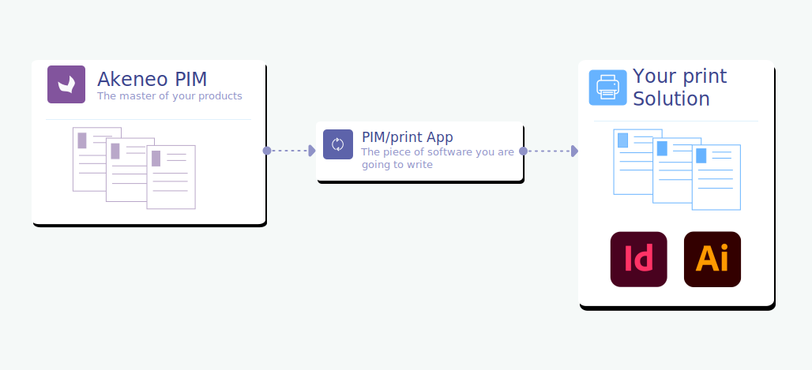

# Who does what?

## Macro overview

Akeneo PIM provides a single place to collect, manage, and enrich product information, create a product catalog, and distribute it to your print solution.

In the context of a "PIM/print" architecture, the **PIM becomes the Reference of marketing product information**.

## Akeneo PIM and ERP solution...

As seen previously, Akeneo PIM is therefore the source for product information... but what data are we talking about?

### Does Akeneo PIM have all product information needed for the print solution?

The answer is NO (most of the time) because Akeneo PIM should only manage **"cold" product information**. It means that Akeneo PIM only owns marketing product information that needs to be checked, organized, enriched. And “cold” product information means that this information does not change every day.

Concerning **“hot product information”** (i.e. product information that changes frequently: prices or stock), this information should be directly transmitted to the print solution without passing through Akeneo PIM. **“Hot product information”** flow should go directly from the ERP to the print solution (It’s the ERP's responsibility to deliver this information. Again: a PIM only manages “cold” Marketing product information).

::: info
For example, **up-to-date price** of a product should never be stored in Akeneo PIM and should be transmitted directly from the ERP into the print solution.
:::

For price information, Akeneo PIM has the capability of storing product price information, but only for a **“reference”** price and not an **“up-to-date”** price.

In conclusion, it really depends on your customer's needs for his print catalog or his brochure...

One solution to this topic is to consider that the product price information can come from either the ERP or Akeneo PIM.

## Akeneo PIM and DAM

Akeneo PIM manages product-related media.

As of PIM version 4.0, Akeneo also facilitates the connection with a DAM software thanks to its [new asset management system](/concepts/asset-manager.html).

:::tips
If you want to know how a DAM connection works, don't hesitate to read our [dedicated documentation](../dam-connection/introduction.html).
:::

There are 2 different ways to manage media with the PIM:

* **Akeneo PIM without a DAM**

Akeneo PIM manages product media internally (with some specific media attributes or its asset manager). Media binaries are then stored directly into the PIM.

* **Akeneo PIM with a DAM**

The DAM solution transfers its data to the PIM (media asset URL and its metadata) and the PIM is then responsible for linking products to media assets.

Instead of binaries stored in the PIM method, the use of media URLs (and therefore the use of a DAM/CDN in addition to a PIM is undoubtedly the best solution to manage product images and allow them to be transferred into the print solution in a smooth and optimized way as URL information.

::: info  
2 possible configurations to manage media with the PIM:
* Akeneo PIM alone: the PIM manages media **as binaries**,
* Akeneo PIM associated to a DAM/CDN: the PIM manages media **as URLs** (this is the recommended method for performance reasons).
:::

## Conclusions

In conclusion, in relation to what has been said above, it is, therefore, necessary to consider the following possible architectures which may lead to completely different PIM catalog models:

### Architecture ERP / PIM / print solution

### Architecture ERP / DAM / PIM / print solution

Of course these are only basic PIM architectures: some clients may have multiple data sources or destinations making the data workflow managed by your connector more complex… However, for asset media management, we suggest that you focus on these 2 typical architectures that we believe are the most used by our clients.

::: info
Sometimes, a PIM/print connector doesn't work alone and needs and an **ERP/print connector** in order to have all product information in your print solution.
:::   
